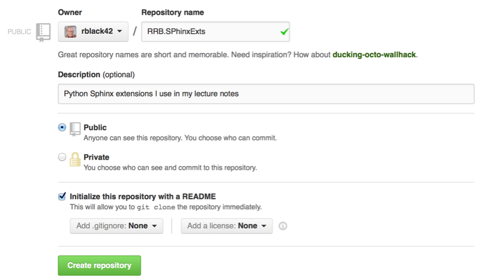

Setting up a GitHub project
###########################

..  include::   /references.inc

I many cases, I create a new repository for a project on GitHub_ then clone
that repository to start work. Occasionally, I do things in reverse. The
project is already set up and I need to get it onto GitHub. This note is
designed to help you set your project up in either case.

..  note::

   I am assuming you have an active account on GitHub_. These are free and I
   highly recommend you set one up if you write any code of your own, and want
   to make it public (perhaps for potential employers to see). If you are a
   student, be careful not to put your coursework on this publis system.  That
   is unless you want your classmates to steal your work and get credit for for
   your hard work!

Starting from scratch
*********************

In this situation, you have a project in mind, but have not started work on
that project. You should come up with a name for your project before you go on,
though! FOr this exercise, I will assume your project is named ``TestProject``.

Start off by opening your web browser and logging into your account on GitHub_.
You should see a menu item near the top that lists all of your current
`Repositories` Click on this and you will see a button labeled "New". This is
where you will create a  new repository.

You will need to fill in this form:

You should fill in the project name, and enter a short description. You should
also create a README file by checking the box near the bottom of this for,.
When you are done, click on :menuselection:`Create` and your new repository
should be ready to go!

Now, navigate to the directroy where you want to set up this project and do
this:
 
..  code-block:: text

    git clone https://github.com/rblack42/RRB.SphinxExt

You will have a new repository with the project name in the current directory.
Rememebr that Git_ will be set up to manage this directory!

Adding an existing project to GitHub
************************************

In this case, we have already started a new project, and we wish to put the
code up on GitHub_. The procedure is a bit different, as you might suspect.

The .gitignore file
===================

You should start off by adding a ``.gitignore`` file to the root of your
project directory. We will use this file to exclude certain files and
directories from the GitHub_ repository we will be setting up. Here is my
initial file:

..  literalinclude::    .gitignote

As you can see, I am not going to put my virtual environment in the repo! I
also add a few standard things here, since I use them a lot. For instance, I
often keep example code I download for my project in the ``_unpublished``
directory, and I do not want to put this on the GitHub server. 

Setting up the repo
===================

We set up this project directory as a Git_ repository by doing this:

..  code-block:: text

    git init

This creates a new, empty, reposotory . There are not files being managed at this point. We can see what Git_ thinks of all this by checking the current status:

..  code-block:: etxt

    git status
    # On branch master
    #
    # Initial commit
    #
    # Untracked files:
    #   (use "git add <file>..." to include in what will be committed)
    #
    #	.gitignore
    #	README.rst
    #	docs/
    #	fabfile.pyc
    #	glossary.rst
    #	index.rst
    #	references.inc
    #	requirements.txt
    nothing added to commit but untracked files present (use "git add" to track)

We need to add all the project files to the Git_ project. We do this in two steps:

..  gode-block::    text

    git add .
    git add .gitignore

Now, we see that Git has added everything to the repo:

..  code-block:: text

    git status
    # On branch master
    #
    # Initial commit
    #
    # Changes to be committed:
    #   (use "git rm --cached <file>..." to unstage)
    #
    #	new file:   .gitignore
    #	new file:   README.rst
    #	new file:   docs/GitHub/.CreateRepo.rst.swp
    #	new file:   docs/GitHub/CreateRepo.rst
    #	new file:   docs/GitHub/GitHubProject.rst
    #	new file:   docs/GitHub/GitRepo1.png
    #	new file:   docs/GitHub/GitRepo2.png
    #	new file:   docs/GitHub/GitTags.rst
    #	new file:   docs/SphinxExtensions.rst
    #	new file:   fabfile.pyc
    #	new file:   glossary.rst
    #	new file:   index.rst
    #	new file:   references.inc
    #	new file:   requirements.txt

We make these changes "official" by ``commiting`` them to the repository:

..  code-block:: text

    git commit -m Initial project commit"

Nothing special happens here. All files in the project ar enow being managed by
Git_. As long as we periodically add and commit changes, Git_ will track what
is happening to our project files.

Uploading the project to GitHub
===============================

Everything we have done up to this point is local on our development machine.
We need to upload the repository to GitHub so it can be viewed on a web
browser, and potentially clones by interested developers!

Create the repo on GitHub
-------------------------

We again create a new project on GitHub_ as we did earlier. Once this has been done, we tell our current project that it will live on the server as follows:

..  code-block:: text

    git remote add origin https://github.com/rblack/RRB.SPhinxExt.git
    git push -u origin master

..  note::

    GitHub_ adds the ``.git`` extension to repositories it manages. Be sure to
    add this when you add the remote.

